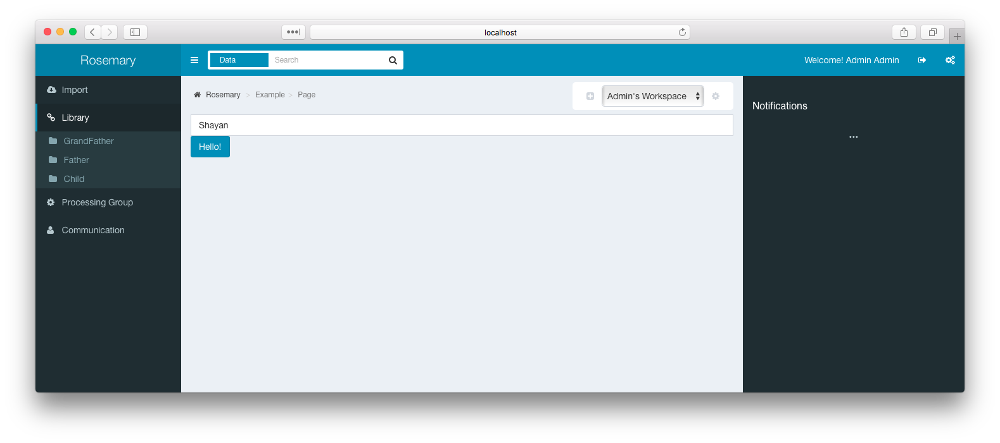

# How to add a new page in the frontend

Using this tutorial we are going to explain everything that is needed to add a new page to the frontend.

## Step 1

It has several components, and we start of with the central part of it all: The controller:

```coffee
module = angular.module 'Rosemary'
module.controller 'ExampleController', ($scope, $rootScope) ->

  new class extends DefaultController

    ###########################
    # Instance variables      #
    ###########################

    # Example variable
    name: "Shayan"

    ###########################
    # constructor & init      #
    ###########################

    # Always call super with scope
    constructor: ->
      super $scope, $rootScope

    # Optional init method (gets automatically called on start)
    init: =>
      @root.breadcrumb = [ 'Example', 'Page' ] # Display's as Example -> Page

    # Optional destroy method (gets automatically called on end)      
    destroy: ->

    ###########################
    # Methods                 #
    ###########################
    
    # Example method
    sayHi: => alert "Hello #{@name}!"
```

As you can see, we use a coffeescript class as the base of an Angular controller. One of the features of extending the DefaultController is that every method of the class will be available at template level inside the ctrl variable. So as an example, `{{ctrl.sayHi('Shayan')}}` will call the method `sayHi` on the controller.

Recommended location to store the controller is `ui/script/controllers`.

## Step 2

This step is simple enough, just create a template in the folder `public/views`. For our example, we create the following:

```html
<div class="row">
  <div class="col-sm-12">
    <input type="text" class="form-control" ng-model="ctrl.name">
    <button type="button" class="btn btn-primary" ng-click="ctrl.sayHi()">Hello!</button>
  </div>
</div>
```

## Step 3

Connect the dots! We have to tell angular about our newly create files, an to do so, we open `app.coffee`. There, you see a long list with routes:

```coffee
  $stateProvider
    .state 'open',
      templateUrl: "views/open.html"
      controller: "OpenController"
      abstract: true
    .state 'open.register',
      url: "/register"
      templateUrl: "views/register.html"
      controller: "RegisterController"
    .state 'open.login',
      url: "/login"
      templateUrl: "views/login.html"
      controller: "LoginController"
    .state 'main',
      templateUrl: "views/main.html"
      controller: "MainController"
      abstract: true
    .state 'main.data',
      url: "/data"
      templateUrl: "views/data.html"
      controller: "DataController"
    # More...
```

This is where we are going to add our page. As you can see, there are 2 kinds of pages. Open and Main. The difference is their parent container. The open container has no menu/breadcrumbs and all that stuff. Ideally for pages when people are not logged in (and also the only ones available when you are not logged in). If you would go to a `main.*` page, and have no valid token or credentials, you would automatically be redirected to `open.login`. Because we want our page to have a nice menu, we are going to add it below menu. This results in adding the following state:

```coffee
    .state 'main.example',
      url: "/example"
      templateUrl: "views/example.html"
      controller: "ExampleController"
```

The result should be as pretty as this!:



## Communication with the backend

Look at the inline documentations in the remote.coffee and object.coffee services in ui/services/